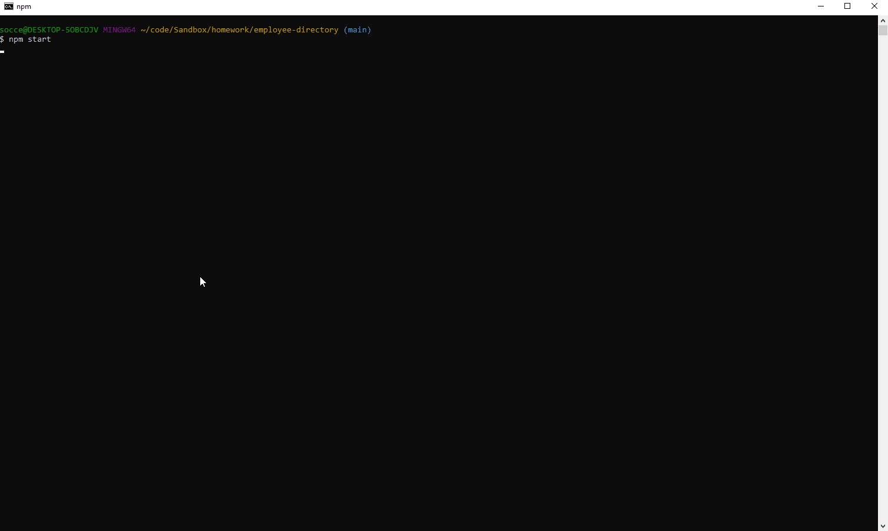

# employee-directory   
## Description  
This is a CLI command app that allows you to create and store an employee directory for your business.
 

## Table of Contents
  * [Description](#Description)
  * [Screenshots](#Screenshot)
  * [Installation](#Installation)
  * [Usage](#Usage)
  * [License](#License)
  * [Contributing](#Contributing)
  * [Test](#Tests)
  * [Questions](#Questions)
 

## Screenshot

## Installation
Download the repo from github.  Run npm i inyour root directory to install any dependencies.  Run npm start to start the app.
 

## Usage
Use this app to track the departments, roles, employees and managers in your company.  You can view, add, update or delete any of those categories by following the command list prompts.
 

## License
This application is covered under the [MIT](https://www.opensource.org/licenses) license.
 

## Contributing
Please submit any issues on github using the issues tracker.
 

## Tests
There are no tests currently running for this app.
 

## Questions
If you have any questions, feel free to find me on github, [jburz](https://www.github.com/jburz) or send me an email at jake.bilbao.04.06@gmail.com.
  